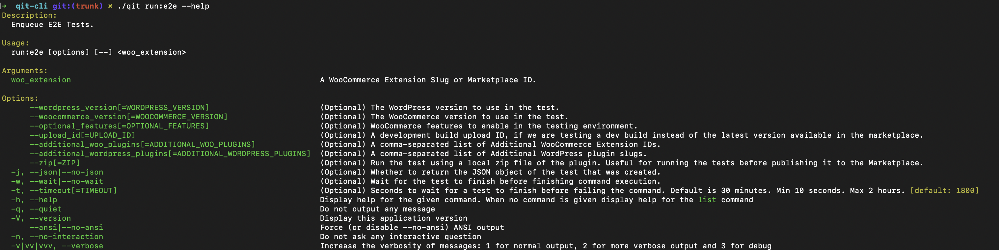

# Getting started

The QIT CLI is a command line interface tool that allows you to run automated tests in the cloud against extensions available in the WooCommerce Marketplace, powered by the Quality Insights Toolkit test runner.



## Requirements

- PHP 7.2.5 or higher
- Unix environment (Linux, macOS, Windows WSL)
- Composer

## Installing

There's two approaches that can be used to install the QIT CLI: Composer (recommended) and using a `phar` file

### Composer

Composer is the recommended approach. This project has zero dependencies.

_Since this repository is still private, a simple `composer require` is not available for now._

1. Place this in your `composer.json`.

```json
{
  "require-dev": {
    "woocommerce/qit-cli": "dev-trunk"
  },
  "repositories": [
    {
      "type": "vcs",
      "url": "git@github.com:woocommerce/qit-cli.git"
    }
  ]
}
```

2. Run `composer update`. It might prompt you for a GitHub Personal Access Token.
3. Run `./vendor/bin/qit partner:add` to configure your credentials. This authentication flow makes use of [WordPress Application Passwords](https://make.wordpress.org/core/2020/11/05/application-passwords-integration-guide/).

### Phar

1. Download the [qit](https://github.com/woocommerce/qit-cli/releases/latest/) phar directly from the latest release.\*
2. Make it executable: `chmod +x qit.phar`
3. Move the binary to a directory in PATH, giving preference for a directory that doesn't require root: `(test -w ~/.local/bin && echo $PATH | grep -q "/.local/bin") && mv qit.phar ~/.local/bin/qit || sudo mv qit.phar /usr/local/bin/qit`
4. Run `qit partner:add` to configure your credentials. This authentication flow makes use of [WordPress Application Passwords](https://make.wordpress.org/core/2020/11/05/application-passwords-integration-guide/).

_\* Since this is a private repo, downloading with `curl` or `wget`, like WP-CLI, won't work._
