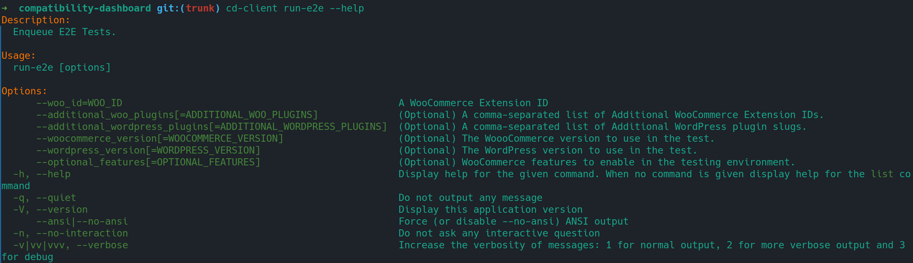

# Getting started

The QIT Client is a command line interface tool that allows you to run automated tests in the cloud against extensions available in the WooCommerce Marketplace, powered by the Quality Insights Toolkit test runner.



## Requirements

- PHP 7.2.5 or higher
- Unix environment (Linux, macOS, Windows WSL)
- Composer

## Installing

There's two approaches that can be used to install the QIT Client: Composer (recommended) and using a `phar` file

### Composer

!> Since this repository is still private, a simple `composer require` is not available for now.

1. Place this in your `composer.json`.

```json
{
  "require-dev": {
    "woocommerce/cd-client": "dev-trunk"
  },
  "repositories": [
    {
      "type": "vcs",
      "url": "git@github.com:woocommerce/cd-client.git"
    }
  ]
}
```
2. Run `composer update`. It might prompt you for a GitHub Personal Access Token.
3. Run `./vendor/bin/cd-client init-a8c` to configure your credentials.

?> Note that this project has zero dependencies.

### Phar

1. Download the [cd-client](https://github.com/woocommerce/cd-client/releases/latest/download/cd-client) phar directly from the latest release.
2. Make it executable: `chmod +x cd-client.phar`
3. Move the binary to a directory in PATH, giving preference for a directory that doesn't require root: `(test -w ~/.local/bin && echo $PATH | grep -q "/.local/bin") && mv cd-client.phar ~/.local/bin/cd-client || sudo mv cd-client.phar /usr/local/bin/cd-client`
4. Run `cd-client init-a8c` to configure your credentials.