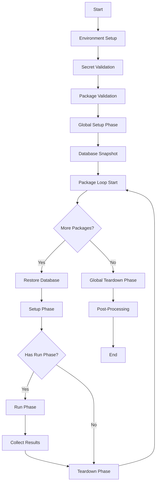

# Understanding the Lifecycle

Custom Tests follow a deterministic lifecycle that ensures consistency, isolation, and reproducibility. Understanding this lifecycle helps you design effective test packages and leverage the full power of the orchestration system.

## Lifecycle Overview



## Detailed Phase Breakdown

### 1. Environment Setup
QIT provisions a test environment with:
- WordPress (specified version)
- WooCommerce (specified version)
- PHP (specified version)
- Your extension under test
- Docker containers for isolation

### 2. Secret Validation
Before any execution:
- Collects required secrets from ALL packages
- Validates environment variables exist
- Fails fast if secrets are missing
- Provides helpful error messages

### 3. Package Validation
Ensures configuration is valid:
- Checks for at least one test package (for `run:e2e`)
- Validates manifest schemas
- Confirms result paths for test packages

### 4. Global Setup Phase
Runs once before all packages:
- Executes `globalSetup` commands from ALL packages
- Commands run in the order packages are listed
- Orchestrator generates CTRF for each command
- Perfect for:
  - Installing helper plugins
  - Configuring WordPress settings
  - Creating test users
  - Seeding initial data

Example:
```json
"globalSetup": [
  "wp plugin install woocommerce-helpers --activate",
  "wp option set woocommerce_task_list_hidden yes",
  "wp user create test test@example.com --role=customer"
]
```

### 5. Database Snapshot
After global setup:
- Exports the database state
- Creates a baseline for all packages
- Ensures test isolation
- Enables fast restoration between packages

### 6. Package Execution Loop

For each package in the configuration:

#### 6.1 Database Restore
- Skipped for the first package (already at baseline)
- Restores snapshot for subsequent packages
- Ensures clean state
- Prevents cross-contamination

#### 6.2 Setup Phase
Package-specific preparation:
- Runs `setup` commands
- Installs dependencies
- Configures package-specific settings
- Orchestrator generates CTRF

Example:
```json
"setup": [
  "npm install",
  "cp .env.example .env",
  "mkdir -p ./results"
]
```

#### 6.3 Run Phase (Test Packages Only)
Actual test execution:
- Only for packages with `run` phase
- Executes test commands
- Package generates its own CTRF
- Captures screenshots, videos, logs

Example:
```json
"run": [
  "npx playwright test --reporter=ctrf"
]
```

#### 6.4 Result Collection (Test Packages Only)
Gathers test artifacts:
- Collects CTRF JSON from specified path
- Copies blob artifacts (screenshots, videos)
- Optional: Collects Allure results
- Fails if results are missing

#### 6.5 Teardown Phase
Package-specific cleanup:
- Runs `teardown` commands
- Removes temporary files
- Resets package-specific state
- Orchestrator generates CTRF

Example:
```json
"teardown": [
  "rm -rf ./temp",
  "wp option delete test_option"
]
```

### 7. Global Teardown Phase
Runs once after all packages:
- Executes `globalTeardown` commands from ALL packages
- Final cleanup opportunity
- Orchestrator generates CTRF

Example:
```json
"globalTeardown": [
  "wp user delete test --yes",
  "wp plugin deactivate woocommerce-helpers"
]
```

### 8. Post-Processing
Finalizes results:
- Merges all CTRF reports
- Generates HTML from blob artifacts
- Uploads Allure results (if configured and tests failed)
- Creates shareable URLs
- Saves debug logs

## Execution Contexts

### Host vs Container
Commands can run in different contexts:

- **Host commands** (marked with `[host]`): Run on the host machine
- **Container commands**: Run inside the WordPress Docker container

The orchestrator automatically determines the appropriate context.

### Working Directory
- Commands execute in the package directory
- Relative paths are resolved from the package root
- Access to package files and generated artifacts

## Database Management

### Snapshot Strategy
1. **Baseline snapshot** after global setup
2. **Restore before each package** (except first)
3. **No incremental snapshots** between phases
4. **Final state discarded** after global teardown

### Benefits
- **Isolation**: Tests can't affect each other
- **Speed**: Fast database restoration
- **Reproducibility**: Same starting state for each package
- **Debugging**: Known state at each point

## CTRF Generation

### Orchestrator CTRF
Generated automatically for:
- `globalSetup` commands
- `setup` commands
- `teardown` commands
- `globalTeardown` commands

Format:
```json
{
  "name": "[globalSetup] utilities/setup: wp plugin install",
  "status": "passed",
  "duration": 1234
}
```

### Test Package CTRF
Generated by test framework for:
- Test execution results
- Individual test cases
- Test suites

### Merged CTRF
Post-processing combines:
- All orchestrator CTRF
- All test package CTRF
- Into single comprehensive report

## Output Management

### Standard Mode
Shows all output:
- Commands being executed
- Command output
- Errors and warnings
- Progress indicators

### CI Mode
Suppresses output:
- Shows commands only
- Hides command output
- Shows errors always
- Cleaner logs

### Verbose Mode
Forces full output:
- Overrides CI suppression
- Useful for debugging
- Shows all details

## Best Practices

### 1. Use Global Setup Wisely
- Put shared configuration in `globalSetup`
- Don't repeat common setup in every package
- Examples: Disable wizards, create users, install helpers

### 2. Leverage Database Snapshots
- Don't worry about cleanup between packages
- Each package gets a fresh start
- Focus on your test logic

### 3. Organize Phases Logically
- `globalSetup`: Environment-wide configuration
- `setup`: Package-specific preparation
- `run`: Test execution
- `teardown`: Package-specific cleanup
- `globalTeardown`: Environment-wide cleanup

### 4. Handle Dependencies
- Install in `setup` phase
- Clean in `teardown` phase
- Use package.json or composer.json

### 5. Generate Proper Results
- Ensure CTRF output to specified path
- Capture screenshots on failure
- Include meaningful test names

## Example: Complete Lifecycle

Given this configuration:
```json
{
  "test_packages": [
    "./utilities/environment-setup",
    "./tests/checkout-flow",
    "./tests/payment-gateway",
    "./utilities/cleanup"
  ]
}
```

Execution order:
1. Environment setup
2. Validate secrets from all 4 packages
3. Run globalSetup from all 4 packages
4. Take database snapshot
5. Package 1 (environment-setup):
   - No database restore (first package)
   - Run setup commands
   - Skip run (utility package)
   - Skip results (utility package)
   - Run teardown commands
6. Package 2 (checkout-flow):
   - Restore database snapshot
   - Run setup commands
   - Run test commands
   - Collect results
   - Run teardown commands
7. Package 3 (payment-gateway):
   - Restore database snapshot
   - Run setup commands
   - Run test commands
   - Collect results
   - Run teardown commands
8. Package 4 (cleanup):
   - Restore database snapshot
   - Run setup commands
   - Skip run (utility package)
   - Skip results (utility package)
   - Run teardown commands
9. Run globalTeardown from all 4 packages
10. Post-process and generate reports

## Troubleshooting Lifecycle Issues

### Package Doesn't Run
- Check it's listed in configuration
- Verify manifest.json exists
- Ensure path is correct

### Setup Commands Not Running
- Check `setup` phase in manifest
- Verify command syntax
- Check for typos

### Results Not Found
- Ensure test framework outputs CTRF
- Check path in manifest matches actual output
- Verify test package has `run` phase

### Database State Issues
- Remember restoration happens before each package
- Global setup changes persist to all packages
- Package-specific changes don't carry over

## Next Steps

- [Package Structure](./package-structure.md) - How to organize packages
- [Manifest Schema](./manifest-schema.md) - Detailed manifest documentation
- [Running Tests](./running-tests.md) - Executing your packages
- [Orchestration](./orchestration.md) - Deep dive into the orchestrator