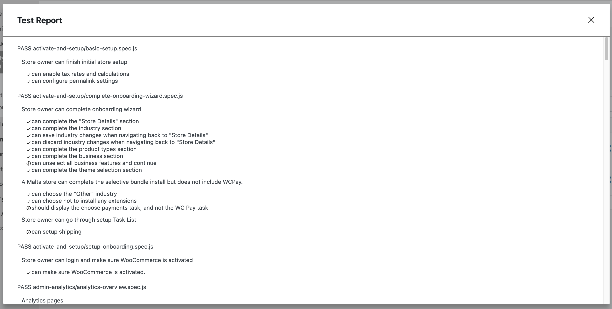

# Viewing test results

To view the tests that were created and their results, navigate to the `All Tests` page under the `Quality Insights` menu:

In the table on this page, all of the tests that you created will be shown in the list, starting with the most recent:

## Filtering results

You can filter the test results shown in the table by selecting one of the three available filters at the top of the page:

- Product: Filter by the product the tests were ran against.
- WooCommerce Release: Filter by the WooCommerce release version the tests were ran against.
- Test Types: Filter by the test type that was ran, such as e2e or activation.

You can also search the tests by providing keywords such as the product, the version, the test type, status or release:

## Viewing test logs

After a test run completes, you'll be able to view a variety of reports depending on the test type.

### End-to-end tests

#### Successful runs

When an end-to-end test passes, you'll be able to view the report and see the tests that were ran by clicking on `View Log`:

This will open a modal that you can scroll through and see the results of each test that was ran:

#### Failed test runs

If an end-to-end test run fails, an Allure test report will be generated. Click on the `View Report` button to see the full details of the Allure test report:

For more information on what the Allure test report contains, see [Understanding Allure test results](understanding-allure-results.md#understanding-allure-test-results)

### Security, Activation, and PHPStan tests

To view the test logs for these test types, click on `View Log` in the table for the extension test results you'd like to view:

This will open a modal where you can view the test results. For example, a failed Security test would show the following in the modal:

You can also use the filter in the modal to filter down to the specific result set you'd like to see:

?> Note that for these test types, there won't be a log available and instead it will show `No Results` instead.

