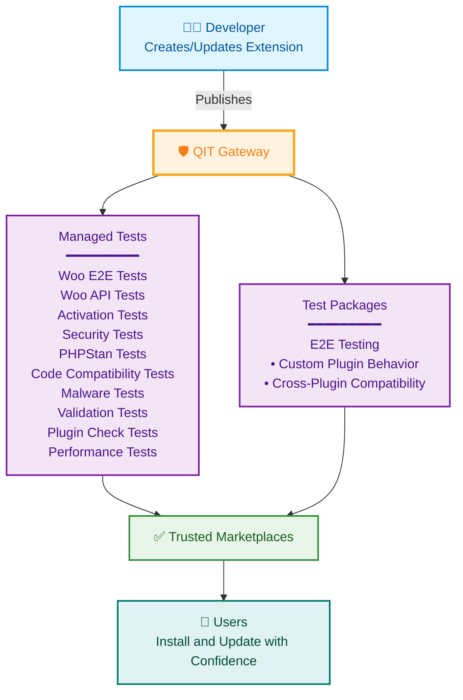

# QIT: Quality Insights Toolkit

QIT is a quality assurance platform for the WordPress ecosystem. It provides the testing infrastructure that helps developers ship reliable extensions and helps marketplaces maintain quality standards.

## The Quality Challenge

WordPress powers 40% of the web through its extensibility. The average WordPress site runs dozens of plugins from different developers, each updated on their own schedule. This creates a quality assurance challenge:

- Developers can't test with every possible plugin combination
- Marketplaces need consistent quality standards
- Users need reliability when combining extensions
- The ecosystem needs shared testing infrastructure

QIT addresses these challenges by providing standardized testing tools that work across the WordPress ecosystem.

## QIT as a Quality Gateway

QIT addresses these challenges by acting as a quality gateway between developers and trusted marketplaces. Every extension passes through automated quality checks before reaching users.

<div style={{textAlign: 'center'}}>



</div>

When a developer publishes an extension, QIT automatically validates quality through comprehensive testing before it reaches users. This gateway ensures every extension in trusted marketplaces meets consistent quality standards.

## Two Testing Approaches

### Managed Tests

Industry-standard quality checks packaged to work consistently across all extensions. These automated tests run with zero setup in development, CI pipelines, and as marketplace quality gates.

Whether you're testing locally, automating in GitHub Actions, or publishing to a marketplace, managed tests provide the same comprehensive validation - ensuring extensions meet security, compatibility, and functionality standards before reaching production sites.

### Test Packages

While managed tests ensure baseline quality, Test Packages solve a deeper problem: **custom plugin behavior and cross-plugin compatibility**.

Test Packages are E2E tests built on Playwright that follow a standardized format, enabling them to be combined and run together. This standardization is what makes cross-compatibility testing possible and allows Test Packages to serve as quality gates alongside managed tests.

Developers can:
- Test their plugin's specific features and custom behavior
- Verify compatibility between multiple plugins
- Combine multiple test packages in a single run
- Share tests so others can validate compatibility with their plugin

```bash
# Example: Combine multiple test packages to verify cross-plugin compatibility
qit run:e2e my-payment-plugin \
  --test-package=./my-custom-tests \
  --test-package=woocommerce/checkout-tests \
  --test-package=subscription-plugin/recurring-tests \
  --test-package=tax-plugin/calculation-tests
```

This is crucial: developers can test **how their plugin actually behaves with other real plugins**, not just in isolation. When payment gateways share their checkout tests, when shipping providers share their calculation tests, when subscription plugins share their renewal tests - the entire ecosystem becomes more reliable.

## Current Availability

QIT is currently available to WooCommerce.com Marketplace developers. We're actively working to expand access to extensions outside the WooCommerce Marketplace, making quality infrastructure available to the broader WordPress ecosystem.

## Next Steps

Ready to start using QIT? Learn how to install, authenticate, and run your first tests.

[Get Started with QIT →](getting-started.md)