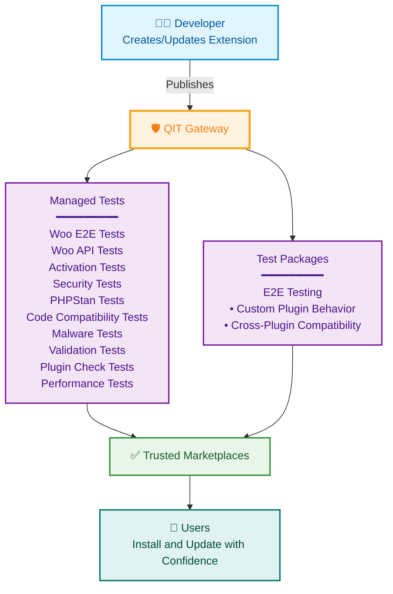

Quality Insights Toolkit

  Automated testing infrastructure for WooCommerce extensions. 
  The official quality gateway for the <strong>WooCommerce.com Marketplace</strong>.

  

    
🛡️

    <h3>Managed Tests</h3>
    
10 automated checks (security, compatibility, performance, static analysis) that run with zero setup. Same checks locally, in CI, and at the marketplace gate.

  

  

    
🧩

    <h3>Test Packages</h3>
    
Playwright-based E2E tests in a standardized format. Combine packages from different plugins in one run to verify cross-plugin compatibility.

  

  

    
🐳

    <h3>Local Environment</h3>
    
Sandboxed, Alpine-based Docker environments optimized for CI and automated testing. Spin up, test, tear down.

  

  

    
⚙️

    <h3>CI-Ready</h3>
    
Single CLI that works the same everywhere. Run the full suite in GitHub Actions with <code>qit run</code>. Same commands, same results.

  

  
🤖

  

    <h3>AI-First</h3>
    

      QIT is a CLI designed to be driven by your AI coding agent. Install the <strong>Claude Code</strong> plugin and your agent gets full QIT expertise: running tests, creating test packages, debugging failures, and configuring projects.
    

    <code>/plugin marketplace add woocommerce/qit-cli</code> 
    <code>/plugin install qit@woocommerce-qit</code>
    

      Using another AI assistant? Point it to <a href="https://qit.woo.com/docs/llms.txt">qit.woo.com/docs/llms.txt</a> and ask it to take it from there.
    

  

<a className="qit-cta" href="/docs/getting-started/">Get Started with QIT →</a>

