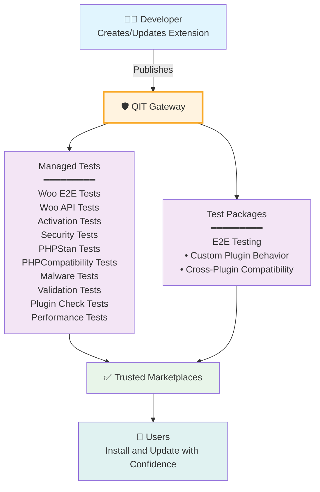

# QIT: Quality Insights Toolkit

QIT is a quality assurance platform for the WordPress ecosystem. It provides the testing infrastructure that helps developers ship reliable extensions and helps marketplaces maintain quality standards.

## The Quality Challenge

WordPress powers 40% of the web through its extensibility. The average WordPress site runs dozens of plugins from different developers, each updated on their own schedule. This creates a quality assurance challenge:

- Developers can't test with every possible plugin combination
- Marketplaces need consistent quality standards
- Users need reliability when combining extensions
- The ecosystem needs shared testing infrastructure

QIT addresses these challenges by providing standardized testing tools that work across the WordPress ecosystem.

## QIT as a Quality Gateway

QIT addresses these challenges by acting as a quality gateway between developers and trusted marketplaces. Every extension passes through automated quality checks before reaching users.

<div style={{textAlign: 'center'}}>



</div>

When a developer publishes an extension, QIT automatically validates quality through comprehensive testing before it reaches users. This gateway ensures every extension in trusted marketplaces meets consistent quality standards.

## Two Testing Approaches

### Managed Tests

Pre-built test suites maintained by QIT that validate security, PHP compatibility, activation, core functionality, and API standards. These automated tests run in the cloud with zero setup, providing consistent quality baselines across all extensions.

Managed tests catch critical issues like security vulnerabilities, compatibility breaks, and activation failures before they reach production sites.

### Test Packages

While managed tests ensure baseline quality, Test Packages solve a deeper problem: **custom plugin behavior and cross-plugin compatibility**.

Test Packages are E2E tests built on Playwright that can be combined and run together. They enable developers to:
- Test their plugin's specific features and custom behavior
- Verify compatibility between multiple plugins
- Combine multiple test packages in a single run
- Share tests so others can validate compatibility with their plugin

```bash
# Example: Combine multiple test packages to verify cross-plugin compatibility
qit run:e2e my-payment-plugin \
  --test-package=./my-custom-tests \
  --test-package=woocommerce/checkout-tests \
  --test-package=subscription-plugin/recurring-tests \
  --test-package=tax-plugin/calculation-tests
```

This is crucial: developers can test **how their plugin actually behaves with other real plugins**, not just in isolation. When payment gateways share their checkout tests, when shipping providers share their calculation tests, when subscription plugins share their renewal tests - the entire ecosystem becomes more reliable.

## Who Uses QIT

### Extension Developers

Build and test with confidence:
- Validate quality during development
- Test compatibility with other extensions
- Automate testing in CI/CD pipelines
- Meet marketplace requirements

### Marketplaces and Platforms

Maintain quality standards at scale:
- Automated testing for all submissions
- Consistent quality requirements
- Reduced support burden
- Higher user satisfaction

### Agencies and Integrators

Ensure reliability for client projects:
- Validate plugin combinations before deployment
- Create test suites for specific configurations
- Automate quality gates in workflows
- Reduce post-launch issues

## Getting Started

Start using QIT in minutes:

```bash
# Install
composer global require "woocommerce/qit-cli:*"

# Authenticate
qit connect

# Run your first test
qit run:activation your-extension
```

From there, you can:
- Run additional managed tests for security and compatibility
- Create Test Packages for your specific features
- Test against other extensions' Test Packages
- Integrate QIT into your development workflow

[Complete Getting Started Guide →](getting-started.md)

## Current Availability

QIT is currently available to:
- WooCommerce Marketplace developers (full access)
- WordPress plugin developers (Test Packages framework)
- Platforms interested in quality standards (contact us)

We're expanding access as we build out the platform. The goal is quality infrastructure that serves the entire WordPress ecosystem.

## The Vision

QIT aims to become the standard quality infrastructure for WordPress. When developers share tests and platforms share standards, the entire ecosystem becomes more reliable. Every site benefits from higher quality extensions that work together.

## Support

- **Issues**: [GitHub Repository](https://github.com/woocommerce/qit-cli/issues)
- **Contact**: qit@woocommerce.com
- **Documentation**: [qit.woo.com](https://qit.woo.com)