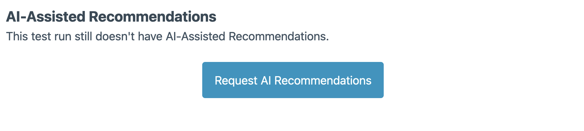

# Security tests

This test runs an experimental security scanner against a given extension.

- Success: No security issues errors or warnings.
- Warning: Only security issues warnings.
- Failure: One or more security issues errors.

### What tools are used?
The tools used in the Security Scanner are, currently, [PHPCS](https://github.com/squizlabs/PHP_CodeSniffer) and [SemGrep](https://semgrep.dev/).

### Can I run it locally?
Ideally, you should delegate all the testing execution to QIT. We don't support running the tests outside of QIT, but you can mimick at least the PHPCS rules. The SemGrep rules are not available to be run locally.

### Which PHPCS rules are enabled?
We use the WordPress Coding Style Standards project. Apart from SemGrep, the Security Tests runs all rules of the `WordPress.Security` namespace, and of `WordPress.DB`.

## What to do when encountering a discouraged function?

We identify functions that may lead to potential security vulnerabilities and mark them with a Warning using the `Generic.PHP.ForbiddenFunctions.Discouraged` rule.

While these functions are not inherently unsafe, they frequently contribute to critical vulnerabilities. We flag them to encourage you to review the code for security. If you've confirmed that the code is secure, you can suppress the warning by adding the following comment on the same line as the function: `// phpcs:ignore Generic.PHP.ForbiddenFunctions.Discouraged`

## What to do if it fails

If your security test is failing, please take the following steps:
- Open the test report
- Identify the causes of failure. The test will log any security issues that our scanner identifies
- Fix the issue and re-run the test

### Request AI-assisted recommendations

Below the list of the found issues from the security audit, there is the option to generate a list of AI-assisted recommendations on how to fix the issues:

After a few minutes, this will generate a report of suggested fixes for the results from the security audit to help provide guidance on how to fix them.

:::info
Our AI-assisted recommendations are still in the early stages of training, so it is expected that it produces some invalid suggestions. **Please use these suggestions carefully.** We trained this model on a large dataset of insecure and secure code, specializing it to convert insecure code into secure code. Your help to train this AI is paramount. Please provide feedback about the suggestions, your feedback is used to constantly improve the models.
:::

### Handling false positives

False positives, or alerts for security issues that do not exist in actuality, may occasionally arise during security testing. Though we've chosen PHPCS and SemGrep rules to minimize such occurrences, it's important to address these false positives in a systematic way.

- **Verification:** The first step is to understand and confirm if it's indeed a false positive. Review the flagged code section and the warning or error raised by the tool. It's always good to revisit the code and the associated rule to understand the potential security implications, if any.
- **Report:** If after careful review, the flag still appears to be a false positive, report it to us. Send an email to qit@woocommerce.com explaining the situation, with the specific test result and the corresponding part of your code. Please make sure to include any additional information that can help us understand why you believe it's a false positive.
- **Suppression (temporarily):** In the meantime, while we investigate the issue, you might want to suppress the false positive to continue your work without disruption. To do so, add a comment line right before the flagged line in your code.
    - For PHPCS errors, add `// phpcs:ignore Rule.Name` on the line where the error is reported. Replace `Rule.Name` with the rule that has caused the false positive, eg: `// phpcs:ignore WordPress.Security.ValidatedSanitizedInput`
    - For SemGrep errors, add `// nosemgrep: rule-id` in a similar manner, replacing rule-id with the SemGrep rule identifier, eg: `// nosemgrep: audit.php.wp.security.xss.query-arg`

Only suppress the error if you are certain that it is a false positive.

- **Resolution:** We'll review your report and communicate our findings. If we confirm it's a false positive, we will work towards fine-tuning our rules to prevent such instances in the future. Your cooperation in reporting these instances is invaluable to improve the quality and accuracy of our security testing.

Please note, suppressing warnings or errors should be done judiciously and is only recommended as a temporary solution. We strongly advise against using it as a permanent solution to avoid security tests. Our goal is to ensure that your extensions are as secure as possible, and ignoring genuine warnings or errors can lead to security vulnerabilities.
