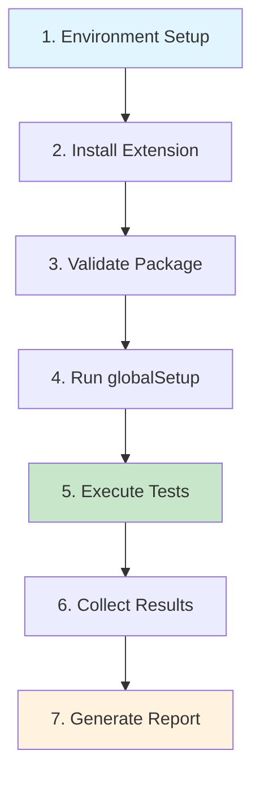

# Quickstart: Your First Test in 5 Minutes

Get from zero to a working test package with real results—fast.

## What You'll Build

A complete E2E test suite that:
- ✅ Tests your WordPress/WooCommerce extension
- ✅ Runs in isolation with guaranteed clean state
- ✅ Produces standardized CTRF results
- ✅ Captures screenshots and videos automatically

## Prerequisites

Before you start, make sure you have:

```bash
# Check prerequisites
docker --version  # Docker 20.10+
node --version    # Node 16+
qit --version     # QIT CLI installed
```

Not installed? See [Installation Guide](../installation)

## Step 1: Scaffold Your Test Package

Create a complete test package structure with one command:

```bash
qit package:scaffold ./my-tests \
  --namespace=my-extension \
  --package=checkout
```

<details>
<summary>📁 What gets created?</summary>

```
my-tests/
├── manifest.json           # Package configuration
├── package.json            # Node dependencies
├── playwright.config.js    # Test framework config
├── bootstrap/
│   ├── global-setup.sh    # Shared setup (all packages)
│   ├── setup.sh           # This package setup
│   └── global-teardown.sh # Final cleanup
└── tests/
    └── example.spec.js    # Sample test
```

The scaffold includes:
- ✅ Playwright pre-configured with CTRF reporter
- ✅ Bootstrap scripts for common tasks
- ✅ Working example test
- ✅ All paths following QIT conventions

</details>

## Step 2: Write Your First Test

Replace the example test with your own:

```javascript
// tests/checkout.spec.js
const { test, expect } = require('@playwright/test');

test('checkout flow works', async ({ page }) => {
  // Navigate to shop
  await page.goto('/shop');
  
  // Add first product to cart
  await page.locator('.add_to_cart_button').first().click();
  await page.waitForSelector('.added_to_cart');
  
  // Proceed to checkout
  await page.goto('/checkout');
  
  // Fill required fields
  await page.fill('#billing_email', 'test@example.com');
  await page.fill('#billing_first_name', 'Test');
  await page.fill('#billing_last_name', 'User');
  
  // Place order
  await page.click('#place_order');
  
  // Verify success
  await expect(page).toHaveURL(/order-received/);
  await expect(page.locator('.woocommerce-thankyou-order-received'))
    .toContainText('Thank you');
});
```

## Step 3: Run Your Tests

Execute your test package against your extension:

```bash
qit run:e2e my-extension \
  --test-package=./my-tests \
  --verbose
```

### What Happens When You Run?



Watch the output:
```
┌─ ENVIRONMENT SETUP ────────────────────────────
│ PHP: 8.2 | WordPress: latest | WooCommerce: latest
│ Installing my-extension...
└────────────────────────────────────────────────

┌─ PACKAGE: my-tests/checkout ───────────────────
│ ➤ Setup phase
│   Installing dependencies...
│ ➤ Run phase
│   Running 1 test...
│   ✓ checkout flow works (3.2s)
│ ➤ Results collected
│   CTRF: ./results/ctrf.json
│   Artifacts: ./results/blob/
└────────────────────────────────────────────────
```

## Step 4: View Your Results

### Open the Report Dashboard
```bash
qit report
```

This opens an interactive HTML report showing:
- Test pass/fail status
- Execution times
- Screenshots on failure
- Video recordings
- Detailed error messages

### Check the Files
Your test package now contains:

```
my-tests/
└── results/
    ├── ctrf.json          # Standardized test results
    └── blob/
        ├── screenshots/   # Failure screenshots
        ├── videos/       # Test recordings
        └── traces/       # Debug traces
```

### Understanding CTRF Output
```json
{
  "summary": {
    "total": 1,
    "passed": 1,
    "failed": 0,
    "duration": 3200
  },
  "tests": [{
    "name": "checkout flow works",
    "status": "passed",
    "duration": 3200
  }]
}
```

## Development Workflow

### Quick Iteration Mode

When developing tests, use a persistent environment:

```bash
# 1. Start environment (stays running)
qit env:up my-extension --global-setup

# 2. Get environment variables
source "$(qit env:source)"

# 3. Run tests with Playwright UI (interactive)
npx playwright test --ui

# 4. Make changes and re-run instantly
npx playwright test --headed --debug
```

### CI/Production Mode

For CI or final validation, use full orchestration:

```bash
qit run:e2e my-extension \
  --config=qit.json \
  --php=8.2 \
  --wordpress=6.4
```

## Common Patterns

### Testing with Secrets

```json
// manifest.json
{
  "requires": {
    "secrets": ["STRIPE_KEY", "STRIPE_SECRET"]
  }
}
```

```bash
# Set secrets before running
export STRIPE_KEY="pk_test_..."
export STRIPE_SECRET="sk_test_..."
qit run:e2e my-extension
```

### Multiple Browsers

```bash
# Test on different browsers
qit run:e2e my-extension -- --project=chromium
qit run:e2e my-extension -- --project=firefox
qit run:e2e my-extension -- --project=webkit
```

### Debugging Failed Tests

```bash
# Run with full output
qit run:e2e my-extension --verbose

# Check logs
cat qit-results/logs/execution.log

# Review artifacts
ls -la my-tests/results/blob/screenshots/
```

## Troubleshooting

<details>
<summary>❌ Docker not running</summary>

```bash
# Start Docker
sudo systemctl start docker  # Linux
open -a Docker               # macOS

# Verify it's running
docker ps
```
</details>

<details>
<summary>❌ Package not found</summary>

```bash
# Use absolute path
qit run:e2e my-extension --test-package="$(pwd)/my-tests"

# Or relative from project root
cd /project/root
qit run:e2e my-extension --test-package=./my-tests
```
</details>

<details>
<summary>❌ No CTRF results</summary>

Check your `playwright.config.js` has the CTRF reporter:
```javascript
reporter: [
  ['playwright-ctrf-json-reporter', {
    outputFile: './results/ctrf.json'
  }]
]
```
</details>

<details>
<summary>❌ Tests timeout</summary>

Increase timeout in `playwright.config.js`:
```javascript
module.exports = {
  timeout: 60000,  // 60 seconds
  expect: {
    timeout: 10000  // 10 seconds for assertions
  }
};
```
</details>

## What's Next?

Now that you have a working test package:

### Learn More
- 📚 [Package Concepts](../concepts/architecture-and-lifecycle) — Understand the lifecycle
- 🔄 [Orchestration](../concepts/orchestration-and-execution-order) — How isolation works
- 🔧 [Configure Playwright](../how-to-guides/configure-playwright-ctrf) — Advanced setup

### Do More
- 🚀 [CI Integration](../how-to-guides/ci-github-actions) — Run in GitHub Actions
- 🔐 [Manage Secrets](../how-to-guides/manage-secrets) — Handle sensitive data
- 📦 [Publish Packages](./package-registry-and-versioning) — Share with others

### Get Help
- 💬 [FAQ](../glossary-and-faq/faq) — Common questions
- 🐛 [Troubleshooting](../operations/troubleshooting) — Fix issues
- 📝 [Examples](../examples/index) — Copy working code

---

**Success!** You've created, run, and verified your first test package. The same pattern scales from one test to hundreds, from local development to CI/CD pipelines.

**Last updated:** 2025-08-09