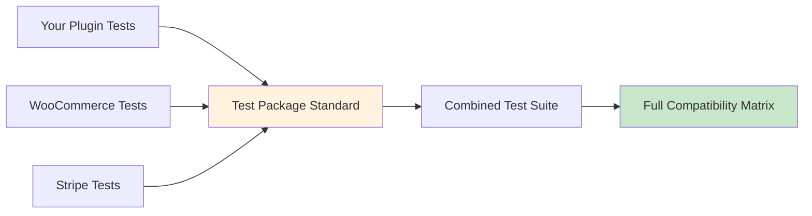

# What are Test Packages?

Test Packages are a minimal standard for E2E tests that makes WordPress ecosystem compatibility testing possible—enabling plugins and themes to share tests and verify they work together.

## The Hidden Crisis in WordPress

Every WordPress site is unique. A typical WooCommerce store might run:
- WooCommerce + Stripe payment gateway
- Advanced Custom Fields for content
- Yoast SEO for search optimization  
- Elementor for page building
- Your custom plugin

**Each plugin tests itself in isolation.** But users don't run plugins in isolation. They run them together.

When Stripe updates their gateway, they can't test with every shipping method plugin. When you release your plugin, you can't test with every payment gateway. The ecosystem has no way to verify plugins actually work together.

**Until now.**

## The Test Package Standard

Test Packages create a simple convention that lets any WordPress extension:
1. **Package their E2E tests** in a standard format
2. **Share them** with other developers
3. **Combine them** to test real-world scenarios
4. **Run them** across any environment matrix



## Why This Changes Everything

### Before Test Packages
- **Stripe** tests their gateway alone
- **Your plugin** tests checkout modifications alone
- **Nobody** tests them together
- **Customers** discover conflicts in production

### With Test Packages
```bash
# Stripe publishes their test package
qit package:publish stripe/gateway-tests

# You test YOUR plugin WITH Stripe's tests
qit run:e2e my-plugin \
  --test-package=stripe/gateway-tests:latest \
  --test-package=./my-tests

# Result: You know they work together BEFORE release
```

## The Standard is Simple

A Test Package is just:

### 1. Your existing Playwright tests
```javascript
test('checkout works', async ({ page }) => {
  await page.goto('/checkout');
  await page.fill('#billing_email', 'test@example.com');
  await page.click('#place_order');
  await expect(page).toHaveURL(/order-received/);
});
```

### 2. A manifest describing them
```json
{
  "namespace": "my-company",
  "package": "checkout-tests",
  "test_type": "e2e",
  "test": {
    "phases": {
      "run": ["npx playwright test"]
    },
    "results": {
      "ctrf-json": "./results/ctrf.json",
      "blob-dir": "./results/blob"
    }
  }
}
```

### 3. That's it

No complex framework. No vendor lock-in. Just a minimal convention that enables maximum compatibility testing.

## Real-World Example: Payment Gateway Testing

Imagine you're building a payment gateway. You need to ensure it works with:
- Different WooCommerce versions
- Various shipping methods
- Other payment gateways (multi-gateway checkouts)
- Subscription plugins
- Currency switchers

### Without Test Packages
You'd need to:
- Manually install each plugin combination
- Write tests for features you don't own
- Maintain tests for third-party plugins
- Hope nothing breaks

### With Test Packages
```bash
# Use the community's shared test packages
qit run:e2e my-gateway \
  --test-package=woocommerce/checkout-tests \
  --test-package=woocommerce-subscriptions/recurring-tests \
  --test-package=fedex/shipping-tests \
  --test-package=./my-gateway-tests

# Test across versions
--wordpress=6.5 --woocommerce=8.6  # Current
--wordpress=6.4 --woocommerce=8.5  # Previous
--wordpress=latest --woocommerce=latest  # Upcoming
```

You're now testing with **actual tests from actual plugin vendors**, not your assumptions about how their plugins work.

## The Network Effect

As more plugins adopt Test Packages:

### Plugin Developers
- Test with real WooCommerce test scenarios
- Verify compatibility with popular plugins
- Catch integration issues before release

### Theme Developers
- Ensure themes work with major plugins
- Test responsive checkout flows
- Verify page builder compatibility

### WooCommerce Core
- Share official test suites
- Let extensions test against upcoming changes
- Maintain backward compatibility

### The Ecosystem
- **Shared quality standards** across all extensions
- **Predictable compatibility** between plugins
- **Fewer broken sites** in production

## Who's Using Test Packages?

### Extension Developers
Share your test suite so others can verify compatibility with your plugin.

### Marketplace Vendors
Require Test Package compatibility for listed products.

### Agencies
Combine client plugin tests into comprehensive compatibility suites.

### Hosting Providers
Verify plugin combinations before recommending them to customers.

## Getting Started

### Use Existing Test Packages
```bash
# Find packages in the registry
qit package:search woocommerce

# Run them with your plugin
qit run:e2e my-plugin --test-package=woocommerce/core-tests
```

### Create Your Own
```bash
# Scaffold a package
qit package:scaffold ./tests --namespace=my-plugin

# Write standard Playwright tests
npx playwright test

# Share with the community
qit package:publish ./tests
```

### Combine Multiple Packages
```json
{
  "test_packages": [
    "woocommerce/checkout-tests",
    "stripe/payment-tests",
    "./my-custom-tests"
  ]
}
```

## The Technical Foundation

Test Packages work because they provide:

- **Standard format**: Everyone uses the same structure
- **Orchestration**: Managed execution across environments
- **Isolation**: Each package gets a clean state
- **Aggregation**: Unified results across all packages

Want the deep technical details? See [Architecture & Lifecycle](../concepts/architecture-and-lifecycle).

## Join the Compatibility Revolution

Test Packages aren't just another testing tool. They're a **community standard** that makes comprehensive WordPress compatibility testing possible for the first time.

When everyone can share and combine tests, everyone's plugins work better together.

### Quick Start
- **[Quickstart Guide](./quickstart-scaffold-run-verify)** — Create your first package
- **[Package Registry](./package-registry-and-versioning)** — Find and share packages
- **[Multi-Package Testing](./tutorial-first-multipackage-run)** — Combine test suites

### Learn More
- **[Orchestration Concepts](../concepts/orchestration-and-execution-order)** — How isolation works
- **[Environment Models](../concepts/environment-models)** — Testing strategies
- **[Package Capabilities](../concepts/package-capabilities)** — What packages can do

---

**Test Packages: The missing standard for WordPress compatibility testing.**

Stop testing in isolation. Start testing in reality.

**Last updated:** 2025-08-09