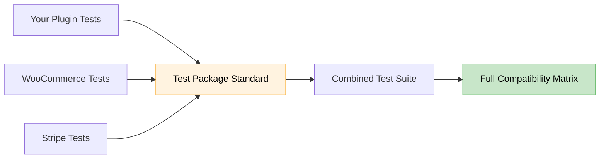

# Test Packages

Test Packages are a minimal standard for E2E tests that makes WordPress ecosystem compatibility testing possible - enabling plugins and themes to share tests and verify they work together. They're the missing piece that lets developers stop testing in isolation and start testing in reality, running their code against real test suites from other plugin vendors to catch compatibility issues before customers do.

## The Compatibility Challenge

Every WordPress site is unique. A typical WooCommerce store might run:
- WooCommerce + Stripe payment gateway
- Advanced Custom Fields for content
- Yoast SEO for search optimization
- Elementor for page building
- Your custom plugin

**Each plugin tests itself in isolation.** But users don't run plugins in isolation. They run them together.

When Stripe updates their gateway, they can't test with every shipping method plugin. When you release your plugin, you can't test with every payment gateway. The ecosystem has no way to verify plugins actually work together.

**Until now.**

## The Test Package Standard

Test Packages create a simple convention that lets any WordPress extension:
1. **Package their E2E tests** in a standard format
2. **Share them** with other developers
3. **Combine them** to test real-world scenarios
4. **Run them** across any environment matrix



## Why This Changes Everything

### Before Test Packages
- **Stripe** tests their gateway alone
- **Your plugin** tests checkout modifications alone
- **Nobody** tests them together
- **Customers** discover conflicts in production

### With Test Packages
```bash
# Stripe publishes their test package
qit package:publish woocommerce-stripe/gateway-tests:1.2.0

# You test YOUR extension WITH Stripe's tests
qit run:e2e your-extension-slug \
  --test-package=woocommerce-stripe/gateway-tests:1.2.0 \
  --test-package=./my-tests

# Result: You know they work together BEFORE release
```

## The Minimal Standard

A Test Package requires just:

### 1. Standard Playwright tests
```javascript
test('checkout works', async ({ page }) => {
  // Uses QIT's environment URL
  await page.goto('/checkout');
  await page.fill('#billing_email', 'test@example.com');
  await page.click('#place_order');
  await expect(page).toHaveURL(/order-received/);
});
```

### 2. A manifest describing them
```json
{
  "package": "your-extension-slug/checkout-tests",
  "package_type": "test",
  "test": {
    "phases": {
      "run": ["npx playwright test"]
    },
    "results": {
      "ctrf-json": "./results/ctrf.json",  // Test results
      "blob-dir": "./results/blob"         // Screenshots, videos, traces
    }
  }
}
```

### 3. That's enough to start

That's it - Playwright tests plus a manifest that describes them. The complete Test Package standard offers much more - lifecycle phases for setup/teardown, state management between packages, environment targeting, secret handling, result aggregation - but none of that is required to begin.

Start minimal. Once your package works, it instantly gains superpowers: it can be combined with other packages, run across version matrices, and orchestrated with guaranteed isolation - all without touching your test code.

**Ready to build your first package?** See the [quickstart tutorial](tutorials/quickstart).

## Real-World Example: Payment Gateway Testing

Imagine you're building a payment gateway. You need to ensure it works with:
- Different WooCommerce versions
- Various shipping methods
- Other payment gateways (multi-gateway checkouts)
- Subscription plugins
- Currency switchers

### Without Test Packages
You'd need to:
- Manually install each plugin combination
- Write tests for features you don't own
- Maintain tests for third-party plugins
- Hope nothing breaks

### With Test Packages
```bash
# Use the community's shared test packages
qit run:e2e my-gateway \
  --test-package=woocommerce/checkout-tests:latest \
  --test-package=woocommerce-subscriptions/recurring-tests:5.5.0 \
  --test-package=fedex/shipping-tests:stable \
  --test-package=./my-gateway-tests

# Test across versions
--wp=stable --woo=stable  # Current stable
--wp=6.4 --woo=8.5  # Specific previous versions
--wp=rc --woo=rc  # Release candidates
--wp=nightly --woo=nightly  # Bleeding edge
```

You're now testing with **actual tests from actual plugin vendors**, not your assumptions about how their plugins work.

## Who Benefits?

- **Plugin & Theme Developers** - Ship features faster without fear. Refactor confidently. Test against real scenarios from other plugins instead of guessing how they work.

- **WooCommerce Core** - Share official test suites so extensions can verify compatibility with upcoming releases before they ship.

- **Agencies** - Combine plugin tests into comprehensive suites for client projects. Deploy updates knowing they won't break production.

- **Hosting Providers** - Reduce support tickets, lower churn, happier customers. Recommend plugin combinations with confidence.

- **The WordPress Ecosystem** - Fewer broken sites, predictable compatibility, shared quality standards. Everyone moves faster when compatibility is guaranteed.

## Ready to Start?

```bash
# Try an existing package with your plugin
qit run:e2e my-plugin --test-package=woocommerce/core-tests:latest

# Or create your own in minutes
qit package:scaffold ./tests/e2e --package=my-plugin/e2e:1.0.0
```

## The Technical Foundation

Test Packages work because they provide:

- **Standard format**: Everyone uses the same structure
- **Orchestration**: Managed execution across environments
- **Isolation**: Each package gets a clean state
- **Aggregation**: Unified results across all packages
- **Encapsulated setup**: Each package handles its own initial configuration (WooCommerce dismisses its onboarding flows, Stripe configures its API keys) so you don't have to
- **Decoupled coverage**: Test against real plugin behaviors without maintaining knowledge of their internals

Want to get started? See the [quickstart tutorial](tutorials/quickstart).

## Join the Compatibility Revolution

Test Packages aren't just another testing tool. They're a **community standard** that makes comprehensive WordPress compatibility testing possible for the first time.

When everyone can share and combine tests, everyone's plugins work better together.