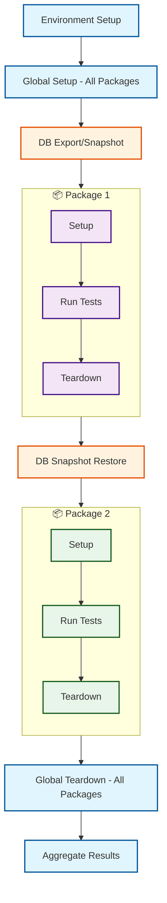

# Using Multiple Packages Together

Learn how QIT orchestrates multiple Test Packages to test real-world plugin combinations.

## The Power of Combination

When you run multiple Test Packages together, QIT:
1. Sets up the environment once
2. Runs global setup phase for all packages
3. Takes a database snapshot
4. Runs each package in isolation (with DB restore between packages)
5. Runs global teardown phase for all packages
6. Aggregates all results

## Basic Multi-Package Testing

### Running Two Packages

```bash
# Your tests + another extension's tests
qit run:e2e your-extension-slug \
  --test-package=./tests/e2e \
  --test-package=another-extension/e2e:latest
```

Output shows both packages:
```
Running 2 Test Packages:
  1. your-extension-slug/e2e (local)
  2. another-extension/e2e:latest

[Package 1/2: your-extension-slug/e2e]
✓ Setup phase
✓ 3 tests passed
✓ Teardown phase

[Package 2/2: another-extension/e2e]
✓ Setup phase
✓ 5 tests passed
✓ Teardown phase

Combined Results:
- Total Tests: 8
- Passed: 8
- Failed: 0
```

### Testing Multiple Extension Compatibility

```bash
# Test your extension with multiple other extensions
qit run:e2e your-extension-slug \
  --plugin=woocommerce-stripe \
  --plugin=woocommerce-subscriptions \
  --test-package=./tests/e2e \
  --test-package=woocommerce-stripe/e2e:latest \
  --test-package=woocommerce-subscriptions/e2e:latest
```

## Understanding Orchestration

When multiple Test Packages run together, QIT follows a specific execution order to ensure proper isolation and consistency. The diagram below illustrates how QIT orchestrates the execution of two packages, showing the global setup/teardown phases that run once for all packages, and the database snapshot/restore operations that provide isolation between each package's execution.

<div align="center">



</div>

### Global Setup and Teardown

The global setup phase runs once before any package executes, and global teardown runs once after all packages complete. This is where shared environment preparation happens (like installing plugins, configuring settings, etc.).

### Database Isolation

Each package gets a clean database state:

```javascript
// Package 1 test
test('create product', async ({ page }) => {
  // Creates product ID 123
  await createProduct('Test Product');
});

// Package 2 test (runs after)
test('list products', async ({ page }) => {
  // Won't see Product 123 - clean database
  const products = await getProducts();
  expect(products).toHaveLength(0); // Clean state!
});
```

## Real-World Scenarios

### Scenario 1: Testing with Payment Extensions

Test your extension with payment gateways:

```bash
qit run:e2e your-extension-slug \
  --plugin=woocommerce-stripe \
  --plugin=woocommerce-subscriptions \
  --test-package=./tests/e2e \
  --test-package=woocommerce-stripe/e2e:latest \
  --test-package=woocommerce-subscriptions/e2e:latest
```

### Scenario 2: Testing Extension Compatibility

Test your extension works with other popular extensions:

```bash
qit run:e2e your-extension-slug \
  --plugin=woocommerce-product-addons \
  --plugin=woocommerce-bookings \
  --test-package=./tests/e2e
```

### Scenario 3: Reproducing Customer Issues

Test with specific versions to match customer environment:

```bash
# Customer reports issue with specific setup
qit run:e2e your-extension-slug \
  --plugin=woocommerce-subscriptions \
  --plugin=woocommerce-stripe \
  --test-package=./tests/e2e \
  --wp=6.4 --woo=8.5  # Match customer's versions
```

## Working with Multiple Local Packages

If you've organized your tests into multiple packages:

```bash
# Run your main tests plus focused packages
qit run:e2e your-extension-slug \
  --test-package=./tests/e2e \
  --test-package=./tests/packages/checkout
```

## Interpreting Combined Results

### Understanding the Output

```
Combined Test Results:
├── your-plugin/checkout-tests
│   ├── ✓ add-to-cart.spec.js (3 passed)
│   └── ✓ checkout.spec.js (2 passed)
├── stripe/gateway-tests
│   ├── ✓ payment.spec.js (4 passed)
│   └── ✗ refund.spec.js (1 failed)
└── woocommerce/core-tests
    └── ✓ critical.spec.js (10 passed)

Summary: 19 passed, 1 failed
```

### Accessing Detailed Reports

```bash
# View combined Allure report
qit report:view

# Get CTRF JSON for CI
cat .qit/results/ctrf-combined.json

# Package-specific results
cat .qit/results/stripe-gateway-tests/ctrf.json
```

## Performance Considerations

### Parallel vs Sequential

By default, packages run sequentially. For independent packages:

```bash
# Future feature: parallel execution
qit run:e2e your-plugin \
  --test-package=./unit-tests \
  --test-package=./integration-tests \
  --parallel
```

### Execution Time

Each package adds time:
- Setup phase: ~5-10 seconds
- Teardown phase: ~2-5 seconds
- DB restore: ~3-5 seconds

Plan accordingly for CI pipelines.

## Best Practices

### 1. Start Small

Begin with two packages, then expand:
```bash
# Start simple
--test-package=. --test-package=woocommerce/core

# Then add more
--test-package=. --test-package=woocommerce/core --test-package=stripe/gateway
```

### 2. Group Related Tests

Combine packages that test related functionality:
- ✅ Payment packages together
- ✅ Shipping packages together
- ❌ Unrelated packages (slower, no benefit)

### 3. Version Consistently

Use consistent versions for related packages:
```bash
# Good: Matching versions
--test-package=woocommerce/checkout:8.5.0 \
--test-package=woocommerce/cart:8.5.0

# Risky: Mismatched versions
--test-package=woocommerce/checkout:8.5.0 \
--test-package=woocommerce/cart:7.0.0
```

## Troubleshooting

### Package Not Found

```
Error: Package stripe/gateway-tests not found
```

Check available packages:
```bash
qit package:list
```

### Conflicting Requirements

```
Error: Package requires WooCommerce >=9.0.0 but environment has 8.5.0
```

Adjust environment or package versions:
```bash
# Use compatible package version
--test-package=stripe/gateway-tests:2.0.0  # Supports WooCommerce 8.x
```

### Test Interference

If tests seem to interfere despite isolation:
1. Check for external dependencies (APIs, files)
2. Verify packages don't modify shared resources
3. Report issue - isolation should prevent this

---

**You've learned:** How to combine Test Packages to test real-world plugin interactions. This is the true power of the Test Package ecosystem!