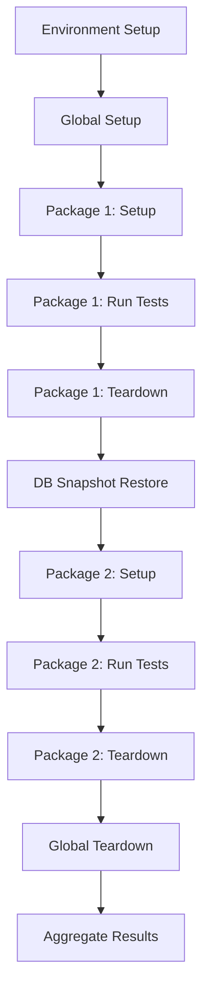

# Using Multiple Packages Together

Learn how QIT orchestrates multiple Test Packages to test real-world plugin combinations.

## The Power of Combination

When you run multiple Test Packages together, QIT:
1. Sets up the environment once
2. Runs each package in isolation
3. Aggregates all results
4. Ensures no test contamination

## Basic Multi-Package Testing

### Running Two Packages

```bash
# Your tests + WooCommerce tests
qit run:e2e your-extension-slug \
  --test-package=./your-tests \
  --test-package=woocommerce/checkout-tests
```

Output shows both packages:
```
Running 2 Test Packages:
  1. your-plugin/your-tests (local)
  2. woocommerce/checkout-tests:8.5.0

[Package 1/2: your-plugin/your-tests]
✓ Setup phase
✓ 3 tests passed
✓ Teardown phase

[Package 2/2: woocommerce/checkout-tests]
✓ Setup phase
✓ 5 tests passed
✓ Teardown phase

Combined Results:
- Total Tests: 8
- Passed: 8
- Failed: 0
```

### Testing Payment Gateway Compatibility

```bash
# Test your plugin with multiple payment gateways
qit run:e2e your-extension-slug \
  --test-package=./your-tests \
  --test-package=woocommerce-stripe/gateway-tests:3.0.0 \
  --test-package=woocommerce-paypal-payments/checkout-tests:latest \
  --test-package=woocommerce-square/payments-tests:2.1.0
```

## Understanding Orchestration

### Execution Order



### Database Isolation

Each package gets a clean database state:

```javascript
// Package 1 test
test('create product', async ({ page }) => {
  // Creates product ID 123
  await createProduct('Test Product');
});

// Package 2 test (runs after)
test('list products', async ({ page }) => {
  // Won't see Product 123 - clean database
  const products = await getProducts();
  expect(products).toHaveLength(0); // Clean state!
});
```

## Real-World Scenarios

### Scenario 1: Subscription + Payments

Test subscription renewals with different payment methods:

```bash
qit run:e2e your-subscription-addon \
  --test-package=./subscription-tests \
  --test-package=woocommerce-subscriptions/renewal-tests:5.5.0 \
  --test-package=woocommerce-stripe/subscription-tests:latest \
  --test-package=woocommerce-paypal-payments/recurring-tests:latest
```

### Scenario 2: Multi-Currency Checkout

Test currency switching with various payment gateways:

```bash
qit run:e2e your-extension-slug \
  --test-package=./currency-tests \
  --test-package=woocommerce-multi-currency/switcher-tests:1.0.0 \
  --test-package=woocommerce-stripe/multi-currency-tests:3.0.0 \
  --test-package=woocommerce-product-price-based-on-countries/currency-tests:2.0.0
```

### Scenario 3: The Kitchen Sink

Test everything your customer reported:

```bash
# Customer says: "Checkout breaks with Subscriptions + Stripe + EU VAT"
qit run:e2e your-extension-slug \
  --test-package=./your-tests \
  --test-package=woocommerce-subscriptions/checkout-tests \
  --test-package=woocommerce-stripe/gateway-tests \
  --test-package=woocommerce-eu-vat-assistant/tax-tests \
  --wp=6.4 --woo=8.5  # Match customer's versions
```

## Advanced Package Selection

### Using Wildcards

Run all tests from a namespace:

```bash
# Run all WooCommerce test packages
qit run:e2e your-extension-slug \
  --test-package=woocommerce/*:latest
```

### Version Matrices

Test across versions:

```bash
# Test with multiple Stripe versions
qit run:e2e your-plugin \
  --test-package=stripe/gateway-tests:2.0.0 \
  --test-package=stripe/gateway-tests:3.0.0
```

### Conditional Packages

Use different packages for different environments:

```bash
# For production testing
qit run:e2e your-plugin \
  --test-package=./smoke-tests \
  --test-package=woocommerce/critical-flows

# For comprehensive testing
qit run:e2e your-plugin \
  --test-package=./full-suite \
  --test-package=woocommerce/checkout-tests \
  --test-package=woocommerce/account-tests \
  --test-package=woocommerce/admin-tests
```

## Interpreting Combined Results

### Understanding the Output

```
Combined Test Results:
├── your-plugin/checkout-tests
│   ├── ✓ add-to-cart.spec.js (3 passed)
│   └── ✓ checkout.spec.js (2 passed)
├── stripe/gateway-tests
│   ├── ✓ payment.spec.js (4 passed)
│   └── ✗ refund.spec.js (1 failed)
└── woocommerce/core-tests
    └── ✓ critical.spec.js (10 passed)

Summary: 19 passed, 1 failed
```

### Accessing Detailed Reports

```bash
# View combined Allure report
qit report:view

# Get CTRF JSON for CI
cat .qit/results/ctrf-combined.json

# Package-specific results
cat .qit/results/stripe-gateway-tests/ctrf.json
```

## Performance Considerations

### Parallel vs Sequential

By default, packages run sequentially. For independent packages:

```bash
# Future feature: parallel execution
qit run:e2e your-plugin \
  --test-package=./unit-tests \
  --test-package=./integration-tests \
  --parallel
```

### Execution Time

Each package adds time:
- Setup phase: ~5-10 seconds
- Teardown phase: ~2-5 seconds
- DB restore: ~3-5 seconds

Plan accordingly for CI pipelines.

## Best Practices

### 1. Start Small

Begin with two packages, then expand:
```bash
# Start simple
--test-package=. --test-package=woocommerce/core

# Then add more
--test-package=. --test-package=woocommerce/core --test-package=stripe/gateway
```

### 2. Group Related Tests

Combine packages that test related functionality:
- ✅ Payment packages together
- ✅ Shipping packages together
- ❌ Unrelated packages (slower, no benefit)

### 3. Version Consistently

Use consistent versions for related packages:
```bash
# Good: Matching versions
--test-package=woocommerce/checkout:8.5.0 \
--test-package=woocommerce/cart:8.5.0

# Risky: Mismatched versions
--test-package=woocommerce/checkout:8.5.0 \
--test-package=woocommerce/cart:7.0.0
```

## Troubleshooting

### Package Not Found

```
Error: Package stripe/gateway-tests not found
```

Check available versions:
```bash
qit package:info stripe/gateway-tests
```

### Conflicting Requirements

```
Error: Package requires WooCommerce >=9.0.0 but environment has 8.5.0
```

Adjust environment or package versions:
```bash
# Use compatible package version
--test-package=stripe/gateway-tests:2.0.0  # Supports WooCommerce 8.x
```

### Test Interference

If tests seem to interfere despite isolation:
1. Check for external dependencies (APIs, files)
2. Verify packages don't modify shared resources
3. Report issue - isolation should prevent this

## Next Steps

- **[Package Concepts](../concepts.md)** - Deep dive into how it works
- **[CI Integration](../ci.md)** - Automate multi-package testing

---

**You've learned:** How to combine Test Packages to test real-world plugin interactions. This is the true power of the Test Package ecosystem!