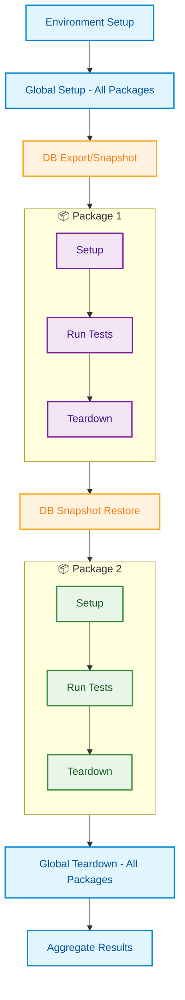

# Using Multiple Packages Together

Learn how QIT orchestrates multiple Test Packages to test real-world plugin combinations.

## The Power of Combination

When you run multiple Test Packages together, QIT:
1. Sets up the environment once
2. Runs global setup phase for all packages
3. Takes a database snapshot
4. Runs each package in isolation (with DB restore between packages)
5. Runs global teardown phase for all packages
6. Aggregates all results

## Basic Multi-Package Testing

### Running Two Packages

```bash
# Your tests + another extension's tests
qit run:e2e your-extension-slug \
  --test-package=./tests/e2e \
  --test-package=another-extension/e2e:latest
```

This runs both test packages in sequence, each with its own isolated database state.

### Testing Multiple Extension Compatibility

```bash
# Test your extension with multiple other extensions
qit run:e2e your-extension-slug \
  --plugin=woocommerce-stripe \
  --plugin=woocommerce-subscriptions \
  --test-package=./tests/e2e \
  --test-package=woocommerce-stripe/e2e:latest \
  --test-package=woocommerce-subscriptions/e2e:latest
```

## Understanding Orchestration

When multiple Test Packages run together, QIT follows a specific execution order to ensure proper isolation and consistency. The diagram below illustrates how QIT orchestrates the execution of two packages, showing the global setup/teardown phases that run once for all packages, and the database snapshot/restore operations that provide isolation between each package's execution.

<div align="center">



</div>

### Global Setup and Teardown

The global setup phase runs once before any package executes, and global teardown runs once after all packages complete. This is where shared environment preparation happens (like installing plugins, configuring settings, etc.).

### Database Isolation

Each package gets a clean database state:

```javascript
// Package 1 test
test('create product', async ({ page }) => {
  // Creates product ID 123
  await createProduct('Test Product');
});

// Package 2 test (runs after)
test('list products', async ({ page }) => {
  // Won't see Product 123 - clean database
  const products = await getProducts();
  expect(products).toHaveLength(0); // Clean state!
});
```

## Real-World Scenario: Testing Payment Integration Compatibility

Let's walk through a concrete example where your shipping extension needs to verify it works correctly with Stripe's payment flow. You'll use community-provided test packages to ensure your extension doesn't break critical WooCommerce flows.

```bash
qit run:e2e your-shipping-extension \
  --woo nightly \
  --plugin=woocommerce-stripe \
  --test-package=./tests/e2e \
  --test-package=woocommerce/minimal:nightly \
  --test-package=woocommerce-stripe/checkout:latest \
  --env STRIPE_TEST_PUBLISHABLE_KEY=pk_test_YourTestKey \
  --env STRIPE_TEST_SECRET_KEY=sk_test_YourTestSecret
```

### What Happens During Execution

#### Global Setup Phase (Once for All Packages)
1. **Environment boots** with WordPress, WooCommerce, your shipping extension, and WooCommerce Stripe
2. **WooCommerce/minimal global setup** runs - disables the onboarding wizard that normally appears on fresh installs
3. **Stripe global setup** configures the payment gateway using the provided sandbox API keys
4. **Your extension global setup** configures default shipping zones and methods
5. **Database snapshot** is taken after all global setup completes

#### Package 1: Your Shipping Extension Tests
Your tests verify that shipping calculations work correctly during checkout:
- Customer adds products to cart
- Proceeds to checkout
- Your shipping rates appear correctly
- Customer can complete purchase with your shipping method selected

#### Database Restore
The environment resets to the clean snapshot state.

#### Package 2: WooCommerce Minimal Tests
These community tests verify core flows still work:
- Products can be added to cart
- Checkout page loads without errors
- Orders can be placed successfully
- No JavaScript errors occur

#### Database Restore
Environment resets again.

#### Package 3: Stripe Checkout Tests  
Stripe's tests verify their payment flow works with your extension active:
- Payment form renders correctly on checkout
- Card validation works
- 3D Secure challenges complete (if configured)
- Payment processes successfully
- Order status updates correctly

#### Global Teardown
Cleanup operations run once after all packages complete.

### Coverage and Guarantees

This combination gives you confidence that:

✅ **Your extension works** - Your own tests pass, confirming your shipping logic is correct

✅ **You don't break WooCommerce** - The minimal tests ensure core e-commerce flows remain functional with your extension active

✅ **You don't break Stripe** - Stripe's checkout tests verify that payment processing still works when your shipping options are present

✅ **Real-world compatibility** - You've tested the actual combination that thousands of stores use: WooCommerce + Stripe + custom shipping

### Important Notes

- **Stripe Sandbox**: The Stripe test package requires valid Stripe test API keys to run properly. These connect to your Stripe sandbox account for realistic payment testing.
- **Test Isolation**: Each package's tests can't interfere with others due to database restoration between runs
- **Shared Environment**: All packages see the same plugins installed, so you're testing real compatibility

## Interpreting Combined Results

When multiple packages run, QIT aggregates all test results and provides detailed reports. You can view results using:

```bash
# View the QIT report (which includes links to Allure reports)
qit report
```

The QIT report shows the overall test results and provides links to detailed Allure reports for each package, making it easy to identify which tests belong to which package and whether any failures occurred.

## Performance Considerations

Packages run sequentially, with each package adding to the total execution time. The database snapshot and restore operations between packages ensure isolation but add a few seconds of overhead. Plan your CI pipeline timeouts accordingly when running multiple packages.

---

**You've learned:** How to combine Test Packages to test real-world plugin interactions. This is the true power of the Test Package ecosystem!