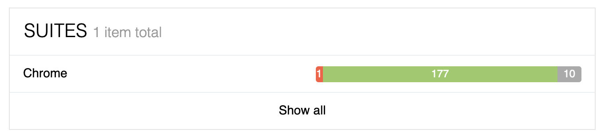
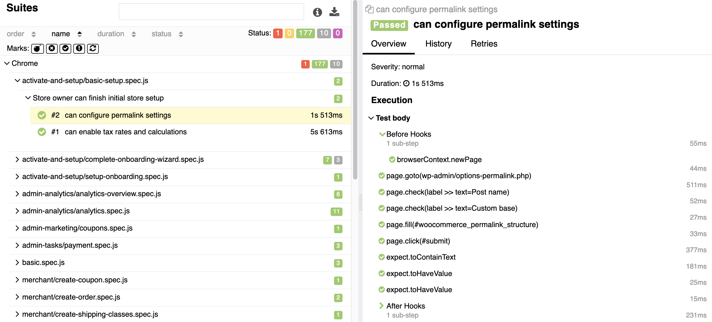

## End-to-End Tests

The end-to-end (e2e) test creates a temporary WordPress installation with WooCommerce and the extension under test installed, and uses a browser that is scripted to perform certain automated tasks, such as completing the WooCommerce onboarding wizard, creating a product, making a purchase as a customer, verifying the order details as an admin, tweaking tax settings, etc.

Then, it runs the [WooCommerce Core end-to-end tests](https://github.com/woocommerce/woocommerce/tree/trunk/plugins/woocommerce/tests/e2e-pw) against a store with your extension activated. These tests cover the [WooCommerce Core Critical Flows](https://github.com/woocommerce/woocommerce/wiki/Critical-Flows) to verify that a given extension does not break the default WooCommerce behaviors. Once the tests complete, the dashboard will show a Success or Failure test result. In the case of a failed test, a link to an [Allure test report](understanding-allure-results.md) will be provided that allows you to dig into the details and see what failed and why.

!> Currently, QIT can only run the WooCommerce Core E2E test suite. Future support for running your own E2E tests is planned.

### Example

This GIF is an example of the end-to-end test running. It performs a series of automated actions in a browser, such as creating a product, making a purchase, and verifying the order details as an admin, as fast as possible. The test is run against a store with the extension under test activated.

Click to view GIF

## What to do if it fails

If your end-to-end test is failing, please take the following steps:

- Check the Allure test report to see what failed and why. If you're unable to reproduce the issue manually, try re-running the test to see if it passes.
- If the test continues to fail, it can be either because of a bug that should be fixed, or because your extension modifies the default WooCommerce behavior in a way that is unexpected by the automated tests. 
- We expect a certain amount of extensions to fail the end-to-end tests because they modify WooCommerce behaviors in ways that the tests are not designed to account for, such as modifying HTML selectors, etc. If you believe that is the case with your extension, please email us at qit@woocommerce.com and we can help you determine the best way to proceed, by either adapting the tests, suggesting some tweaks to your plugin, or by ignoring some tests especifically for your plugin.

## Understanding Allure Reports

For end-to-end test failures, an Allure test report will be generated and is available on the [All Test page](../dashboard/viewing-test-results.md). Allure reports provide a lot of great information to help troubleshoot and diagnose any test failures. For failures, screenshots and a stacktrace is provided. This section provides an overview of a report and where to go to view results. For a more detailed overview, see the official Allure documentation under [Report Structure](https://docs.qameta.io/allure-report/#_report_structure).

## Viewing a report

An Allure report is generated for end-to-end test failures and can be viewed by clicking the `View Report` button on the `Quality Insights > All Tests` page in the QIT Dashboard:

Following this link will open the Allure test results in a modal:

The `Suites` section shows what browser the tests were ran on, and the results of the tests (currently the tests are only ran in Chrome):

This page will provide a quick view into what percentage of tests passed, failed, or were skipped. Any failures will be reported in the `Categories` section under `Product defects`:

## Digging into the details

### Successful results

For successful tests, you can view the details by going into the `Suites` section, either from the `Overview` page or by clicking the `Suites` menu option on the left-hand side. There, you can click into individual tests that passed and view the steps that were taken, the HTML selectors that were used, and what assertions were made:

### Failed cases

When tests fail, Allure will provide the stack trace, the error that it encountered, and a screenshot of where it failed:

This allows you to dig through the steps that were taken by the test, download the stack trace, and see if it's possible to replicate the issue for any potential bugs that may need to be addressed.

!> We've done our best to stamp out as much flakiness as possible in our end-to-end tests, but it can still occur. If you're unable to reproduce the issue manually, try re-running the test to see if it passes.