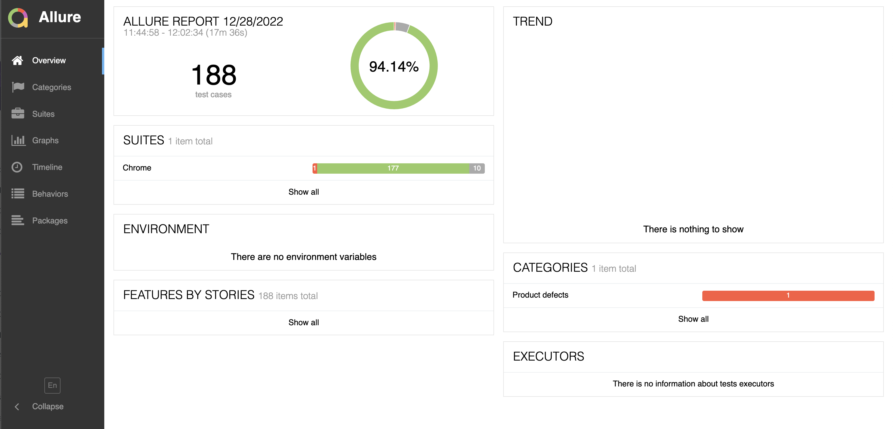
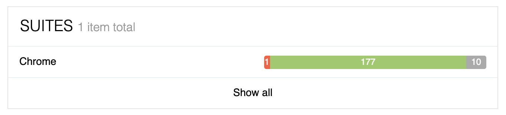
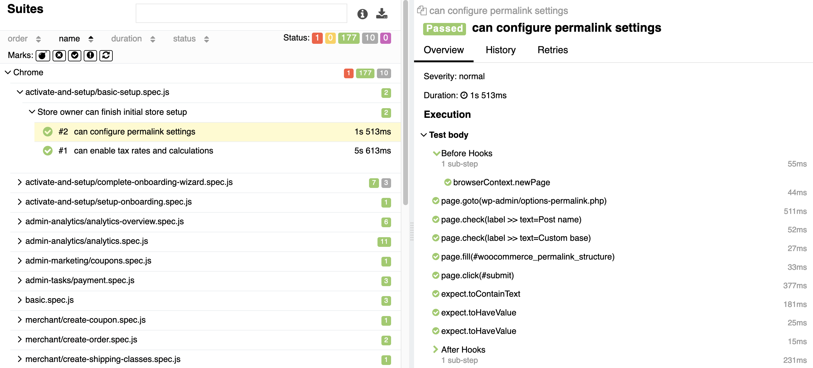

# Understanding Allure test results

For end-to-end test failures, an Allure test report will be generated and is available on the [All Test page](dashboard/viewing-test-results.md). Allure reports provide a lot of great information to help troubleshoot and diagnose any test failures. For failures, screenshots and a stacktrace is provided. This section provides an overview of a report and where to go to view results. For a more detailed overview, see the official Allure documentation under [Report Structure](https://docs.qameta.io/allure-report/#_report_structure).

## Viewing a report

An Allure report is generated for end-to-end test failures and can be viewed by clicking the `View Report` button on the `Quality Insights > All Tests` page in the QIT Dashboard:

Following this link will open the Allure test results in a tab in your browser:

The `Suites` section shows what browser the tests were ran on, and the results of the tests (currently the tests are only ran in Chrome):

This page will provide a quick view into what percentage of tests passed, failed, or were skipped. Any failures will be reported in the `Categories` section under `Product defects`:

## Digging into the details

### Successful results

For successful tests, you can view the details by going into the `Suites` section, either from the `Overview` page or by clicking the `Suites` menu option on the left-hand side. There, you can click into individual tests that passed and view the steps that were taken, the HTML selectors that were used, and what assertions were made:

### Failed cases

When tests fail, Allure will provide the stack trace, the error that it encountered, and a screenshot of where it failed:

This allows you to dig through the steps that were taken by the test, download the stack trace, and see if it's possible to replicate the issue for any potential bugs that may need to be addressed.

!> We've done our best to stamp out as much flakiness as possible in our end-to-end tests, but it can still occur. If you're unable to reproduce the issue manually, try re-running the test to see if it passes.